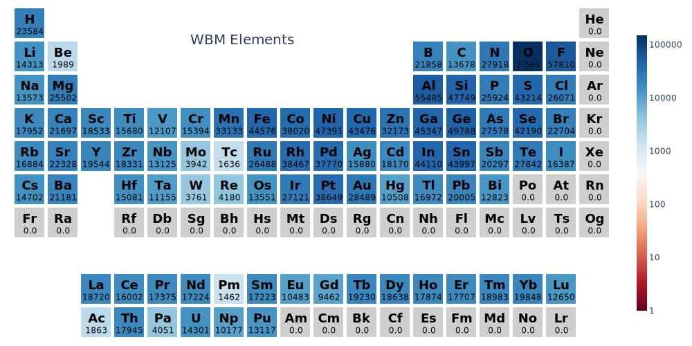
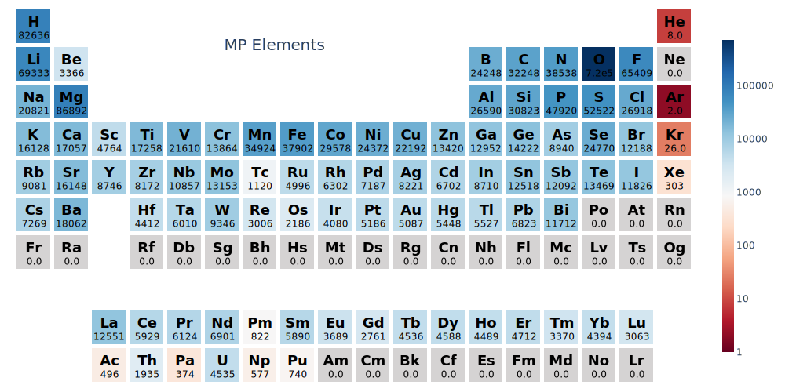
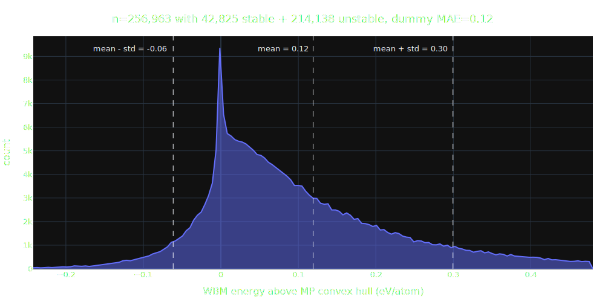

# WBM Dataset

The **WBM dataset** was published in [Predicting stable crystalline compounds using chemical similarity][wbm paper] (Nature Computational Materials, Jan 2021, [doi:10.1038/s41524-020-00481-6](http://doi.org/10.1038/s41524-020-00481-6)). The authors generated 257,487 structures through single-element substitutions on Materials Project (MP) source structures. The replacement element was chosen based on chemical similarity determined by a matrix data mined from the [Inorganic Crystal Structure Database (ICSD)](https://icsd.products.fiz-karlsruhe.de).

The resulting novel structures were relaxed using MP-compatible VASP inputs (i.e. using `pymatgen`'s `MPRelaxSet`) and identical POTCARs in an attempt to create a database of Materials Project compatible novel crystals. Any degradation in model performance from training to test set should therefore largely be a result of extrapolation error rather than covariate shift in the underlying data.

The authors performed 5 rounds of elemental substitution in total, each time relaxing all generated structures and adding those found to lie on the convex hull back to the source pool. In total, ~20k or close to 10% were found to lie on the Materials Project convex hull.

Since repeated substitutions should - on average - increase chemical dissimilarity, the 5 iterations of this data-generation process are a unique and compelling feature as it allows out-of-distribution testing. We can check how model performance degrades when asked to predict structures increasingly more dissimilar from the training set (which is restricted to the MP 2022 database release (or earlier) for all models in this benchmark).

## 🆔 &thinsp; About the IDs

The first integer in each material ID ranging from 1 to 5 and coming right after the prefix `wbm-` indicates the substitution count, i.e. how many times one element was replaced with another chemically similar one starting from an MP source structure. Intuitively, the higher this number the more chance we've had to diffuse away from the MP training set into uncharted regions of materials space. On average, we expect model performance to decrease with substitution step count as structures further from the training set require more extrapolation.

Each iteration has varying numbers of materials which are counted by the 2nd integer. Note this 2nd number is not always consecutive. A small number of materials (~0.2%) were removed by the data-cleaning steps detailed below. Don't be surprised to find an ID like `wbm-3-70804` followed by `wbm-3-70807`.

## 🪓 &thinsp; Data Processing Steps

The full set of processing steps used to curate the WBM test set from the raw data files (downloaded from URLs listed below) can be found in [`data/wbm/fetch_process_wbm_dataset.py`](https://github.com/janosh/matbench-discovery/blob/site/data/wbm/fetch_process_wbm_dataset.py). Processing involved

- re-formatting material IDs
- correctly aligning initial structures to DFT-relaxed [`ComputedStructureEntries`](https://pymatgen.org/pymatgen.entries.computed_entries.html#pymatgen.entries.computed_entries.ComputedStructureEntry)
- remove 6 pathological structures (with 0 volume)
- remove formation energy outliers below -5 and above 5 eV/atom (502 and 22 crystals respectively out of 257,487 total, including an anomaly of 500 structures at exactly -10 eV/atom)

  <caption>WBM Formation energy distribution. 524 materials outside green dashed lines were discarded. (zoom out on this plot to see discarded samples)</caption>
  <slot name="hist-e-form-per-atom">
    
  </slot>

- apply the [`MaterialsProject2020Compatibility`](https://pymatgen.org/pymatgen.entries.compatibility.html#pymatgen.entries.compatibility.MaterialsProject2020Compatibility) energy correction scheme to the formation energies
- compute energy to the Materials Project convex hull constructed from all MP `ComputedStructureEntries` queried on 2022-09-16 ([database release 2021.05.13](https://docs.materialsproject.org/changes/database-versions#v2021.05.13))

Invoking the script `python fetch_process_wbm_dataset.py` will auto-download and regenerate the WBM test set files from scratch. If you find

- any questionable structures or data records in the released test set, or
- inconsistencies between the files on GitHub vs the output of that script,

please [raise an issue](https://github.com/janosh/matbench-discovery/issues).

The number of materials in each step before and after processing are:

| step   | 1      | 2      | 3      | 4      | 5      | total   |
| ------ | ------ | ------ | ------ | ------ | ------ | ------- |
| before | 61,848 | 52,800 | 79,205 | 40,328 | 23,308 | 257,487 |
| after  | 61,466 | 52,755 | 79,160 | 40,314 | 23,268 | 256,963 |

## 🔗 &thinsp; Links to WBM Files

Links to raw WBM data files have proliferated. This is an attempt to keep track of them.

Initial structures (after element substitution but before DFT relaxation) were sent as Google Drive links via email by Hai-Chen Wang on 2021-09-01.

### Google Drive

| Google Drive links | [step 1](https://drive.google.com/file/d/1ZUgtYwrfZn_P8bULWRtTXepyAxHVxS5C) | [step 2](https://drive.google.com/file/d/1-3uu2AcARJxH7GReteGVASZTuttFGiW_) | [step 3](https://drive.google.com/file/d/1hc5BvDiFfTu_tc5F8m7ONSw2OgL9vN6o) | [step 4](https://drive.google.com/file/d/1aMYxG5YJUgMHpbWmHpzL4hRfmP26UQqh) | [step 5](https://drive.google.com/file/d/17kQt2r78ReWle4PhEIOXG7w7BFdezGM1) | [summary](https://drive.google.com/file/d/1639IFUG7poaDE2uB6aISUOi65ooBwCIg) |
| ------------------ | --------------------------------------------------------------------------- | --------------------------------------------------------------------------- | --------------------------------------------------------------------------- | --------------------------------------------------------------------------- | --------------------------------------------------------------------------- | ---------------------------------------------------------------------------- |

### Halle University

The [paper itself][wbm paper] links to a [Halle University data page](https://tddft.org/bmg/data.php) which lists download URLs for CIF files and the `ComputedStructureEntries` (CSEs) of steps 1-3:

| [Halle University links](https://tddft.org/bmg/data.php) | [step 1 CSEs](https://tddft.org/bmg/files/data/substitutions_000.json.bz2) | [step 2 CSEs](https://tddft.org/bmg/files/data/substitutions_001.json.bz2) | [step 3 CSEs](https://tddft.org/bmg/files/data/substitutions_002.json.bz2) | [CIF files](https://tddft.org/bmg/files/data/similarity-cifs.tar.gz) |
| -------------------------------------------------------- | -------------------------------------------------------------------------- | -------------------------------------------------------------------------- | -------------------------------------------------------------------------- | -------------------------------------------------------------------- |

### Materials Cloud

materialscloud:2021.68 includes a readme file with a description of the dataset, meanings of the summary CSV columns and a Python script for loading the data.

| [Materials Cloud archive](https://archive.materialscloud.org/record/2021.68) | [step 1](https://archive.materialscloud.org/record/file?record_id=840&filename=step_1.json.bz2) | [step 2](https://archive.materialscloud.org/record/file?record_id=840&filename=step_2.json.bz2) | [step 3](https://archive.materialscloud.org/record/file?record_id=840&filename=step_3.json.bz2) | [step 4](https://archive.materialscloud.org/record/file?record_id=840&filename=step_4.json.bz2) | [step 5](https://archive.materialscloud.org/record/file?record_id=840&filename=step_5.json.bz2) | [summary](https://archive.materialscloud.org/record/file?record_id=840&filename=summary.txt.bz2) | [readme](https://archive.materialscloud.org/record/file?record_id=840&filename=README.txt) |
| ---------------------------------------------------------------------------- | ----------------------------------------------------------------------------------------------- | ----------------------------------------------------------------------------------------------- | ----------------------------------------------------------------------------------------------- | ----------------------------------------------------------------------------------------------- | ----------------------------------------------------------------------------------------------- | ------------------------------------------------------------------------------------------------ | ------------------------------------------------------------------------------------------ |

[wbm paper]: https://nature.com/articles/s41524-020-00481-6

## 🧪 &thinsp; Chemical Diversity

The WBM test set and even more so the MP training set are heavily oxide dominated. The WBM test set is about 75% larger than the MP training set and also more chemically diverse, containing a higher fraction of transition metals, post-transition metals and metalloids. Our goal in picking such a large diverse test set is future-proofing. Ideally, this data will provide a challenging materials discovery test bed even for large foundational ML models in the future.

Element counts for WBM test set consisting of 256,963 WBM `ComputedStructureEntries`

<slot name="wbm-elements-heatmap">
  
</slot>

Element counts for MP training set consisting of 146,323 `ComputedStructureEntries`

<slot name="mp-elements-heatmap">
  
</slot>

## 🎯 &thinsp; Target Distribution

The WBM test set has an energy above the MP convex hull distribution with mean **0.02 eV/atom** and standard deviation of **0.25 eV/atom**.

The dummy MAE of always predicting the test set mean is **0.17 eV/atom**.

The number of stable materials (according to the MP convex hull which is spanned by the training data the models have access to) is **97k** out of **257k**, resulting in a dummy stability hit rate of **37%**.

> Note: [According to the authors](https://www.nature.com/articles/s41524-020-00481-6#Sec2), the stability rate w.r.t. to the more complete hull constructed from the combined train and test set (MP + WBM) for the first 3 rounds of elemental substitution is 18,479 out of 189,981 crystals ($\approx$ 9.7%).

<slot name="wbm-each-hist">
  
</slot>
