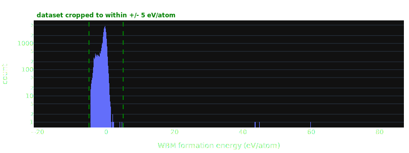
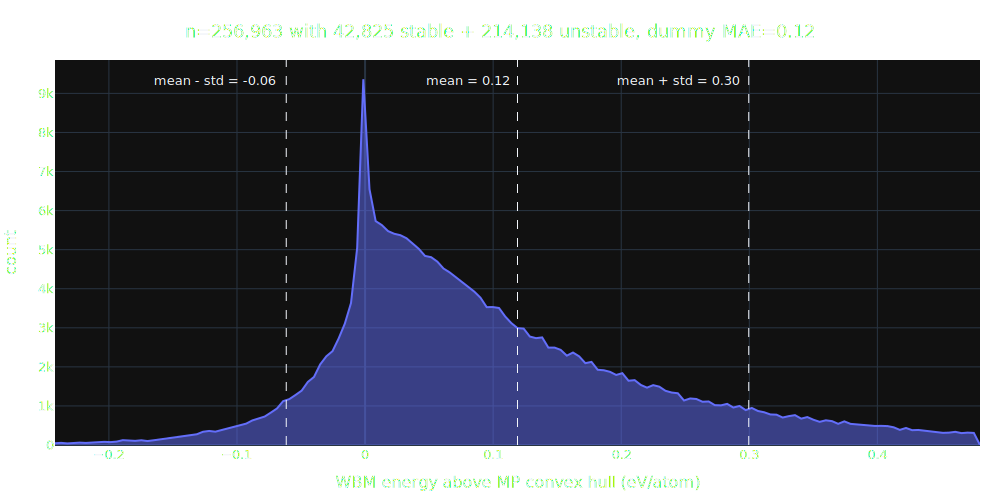
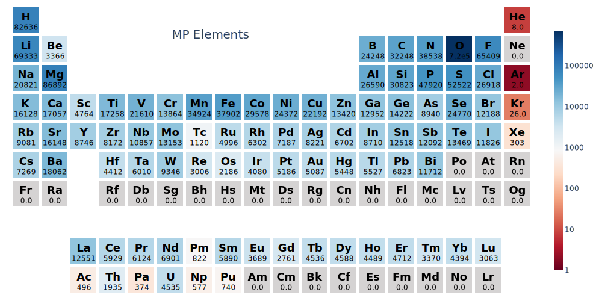

# WBM Dataset

The **WBM dataset** was published in [Predicting stable crystalline compounds using chemical similarity][wbm paper] (nat comp mat, Jan 2021). The authors generated 257,487 structures through single-element substitutions on Materials Project (MP) source structures. The replacement element was chosen based on chemical similarity determined by a matrix data-mined from the [Inorganic Crystal Structure Database (ICSD)](https://icsd.products.fiz-karlsruhe.de).

The resulting novel structures were relaxed using MP-compatible VASP inputs (i.e. using `pymatgen`'s [`MPRelaxSet`](https://github.com/materialsproject/pymatgen/blob/c4998d92525921c3da0aec0f94ed1429c6786c42/pymatgen/io/vasp/MPRelaxSet.yaml)) and identical POTCARs in an attempt to create a database of Materials Project compatible novel crystals. Any degradation in model performance from training to test set should therefore largely be a result of extrapolation error rather than covariate shift in the underlying data.

The authors performed 5 rounds of elemental substitution in total, each time relaxing all generated structures and adding those found to lie on the convex hull back to the source pool. In total, ~20k or close to 10% were found to lie on the Materials Project convex hull.

Since repeated substitutions should - on average - increase chemical dissimilarity, the 5 iterations of this data-generation process are a unique and compelling feature as they allow testing on successively more out-of-distribution (OOD) data slices. We can check how model performance degrades when asked to predict structures increasingly more dissimilar from the training set (which is restricted to the [MP v2022.10.28](https://docs.materialsproject.org/changes/database-versions#v2022.10.28) database release (or earlier) for all models in this benchmark).

## 🆔 &thinsp; About the IDs

The first integer in each material ID ranging from 1 to 5 and coming right after the prefix `wbm-` indicates the substitution count, i.e. how many times one element was replaced with another chemically similar one starting from an MP source structure. Intuitively, the higher this number the more chance we've had to diffuse away from the MP training set into uncharted regions of materials space. On average, we expect model performance to decrease with substitution step count as structures further from the training set require more extrapolation.

Each iteration has varying numbers of materials which are counted by the 2nd integer. Note this 2nd number is not always consecutive. A small number of materials (~0.2%) were removed by the data-cleaning steps detailed below. Don't be surprised to find an ID like `wbm-3-70804` followed by `wbm-3-70807`.

## 🪓 &thinsp; Data Processing Steps

The full set of processing steps used to curate the WBM test set from the raw data files (downloaded from [URLs listed below](#--links-to-wbm-files)) can be found in [`data/wbm/compile_wbm_test_set.py`](https://github.com/janosh/matbench-discovery/blob/-/data/wbm/compile_wbm_test_set.py). Processing steps taken:

- re-format material IDs: `step_1-0->wbm-1-1`, `step_1-1->wbm-1-2`, ...
- correctly align initial structures to DFT-relaxed [`ComputedStructureEntries`](https://github.com/materialsproject/pymatgen/blob/02a4ca8aa0277b5f6db11f4de4fdbba129de70a5/pymatgen/entries/computed_entries.py#L536) (the initial structure files had 6 extra structures inserted towards the end of step 3 which had no corresponding IDs in the summary file)
- remove 6 pathological structures (with 0 volume)
- remove formation energy outliers below -5 and above 5 eV/atom (502 and 22 crystals respectively out of 257,487 total, including an anomaly of 500 structures at exactly -10 eV/atom)

  <caption style="margin: 1em;">WBM Formation energy distribution. 524 materials outside dashed lines were discarded.</caption>
  <slot name="hist-e-form-per-atom">
    
  </slot>

- apply the [`MaterialsProject2020Compatibility`](https://github.com/materialsproject/pymatgen/blob/02a4ca8aa0277b5f6db11f4de4fdbba129de70a5/pymatgen/entries/compatibility.py#L823) energy correction scheme to the formation energies
- compute energy to the Materials Project convex hull constructed from all MP `ComputedStructureEntries` queried on 2023-02-07 ([database release 2022.10.28](https://docs.materialsproject.org/changes/database-versions#v2022.10.28))

Invoking the script `python compile_wbm_test_set.py` will auto-download and regenerate the WBM test set files from scratch. If you find

- any questionable structures or data records in the released test set, or
- inconsistencies between the files on GitHub vs the output of that script,

please [raise an issue](https://github.com/janosh/matbench-discovery/issues).

The number of materials in each step before and after processing are:

| step   | 1      | 2      | 3      | 4      | 5      | total   |
| ------ | ------ | ------ | ------ | ------ | ------ | ------- |
| before | 61,848 | 52,800 | 79,205 | 40,328 | 23,308 | 257,487 |
| after  | 61,466 | 52,755 | 79,160 | 40,314 | 23,268 | 256,963 |

### Prototype Analysis

A common issue that can arise in high-throughput screening is deciding when two materials that are output from a high-throughput workflow should be treated as the same.
At the crudest level of granularity, one could simply compare the reduced formulae of materials.
However, this approach is too coarse-grained to be useful in many cases.
For example, the chemical formulae of two materials could be the same, but the materials could have different crystal structures, the canonical example being graphite and diamond.
Alternatively, materials can be matched by fingerprinting their crystal structures and determining their similarity through some choice of kernel function and cutoff.
This approach has the downside that it can be quite expensive to compute, especially for large datasets, and requires selecting multiple hyperparameters.
We adopt the procedure of determining the prototype of each crystal by looking at the Wyckoff positions of the different elements.
This approach is a middle ground between the two approaches mentioned above in terms of cost, number of hyperparameters and ability to distinguish polymorphs.

We used [`get_protostructure_label_from_spglib`] from the [`aviary`] package in [`compile_wbm_test_set.py`] to get prototype labels in a modified aflow format for each structure.
Having determined the prototypes for both the MP and WBM datasets, we first removed any structures in the WBM dataset that had the same prototype as any structure in the MP dataset.
The next filter was to drop all but the lowest energy structure for each unique prototype remaining in the WBM dataset.
The WBM prototypes were determined for the relaxed structures. This choice avoids inflating the metrics due to duplicates arising from different initial prototypes that fall into the same basin of attraction during relaxation.
In total 41,475 candidates can be removed from the WBM dataset if using this approach.

The number of materials in each step before and after prototype filtering are:

| step   | 1      | 2      | 3      | 4      | 5      | total   |
| ------ | ------ | ------ | ------ | ------ | ------ | ------- |
| before | 61,466 | 52,755 | 79,160 | 40,314 | 23,268 | 256,963 |
| after  | 54,209 | 45,979 | 66,528 | 34,531 | 14,241 | 215,488 |

[`get_protostructure_label_from_spglib`]: https://github.com/CompRhys/aviary/blob/a8da6c468a2407fd14687de327fe181c5de0169f/aviary/wren/utils.py#L140
[`aviary`]: https://github.com/CompRhys/aviary
[`compile_wbm_test_set.py`]: https://github.com/janosh/matbench-discovery/blob/eec1e22c69bc1b0183d7f9138f9e60d1ae733e09/data/wbm/compile_wbm_test_set.py#L587

## 🔗 &thinsp; Links to WBM Files

Links to raw WBM data files have proliferated. This is an attempt to keep track of them.

Initial structures (after element substitution but before DFT relaxation) were sent as Google Drive links via email by Hai-Chen Wang on 2021-09-01.

### Google Drive

| Google Drive links | [step 1](https://drive.google.com/file/d/1ZUgtYwrfZn_P8bULWRtTXepyAxHVxS5C) | [step 2](https://drive.google.com/file/d/1-3uu2AcARJxH7GReteGVASZTuttFGiW_) | [step 3](https://drive.google.com/file/d/1hc5BvDiFfTu_tc5F8m7ONSw2OgL9vN6o) | [step 4](https://drive.google.com/file/d/1aMYxG5YJUgMHpbWmHpzL4hRfmP26UQqh) | [step 5](https://drive.google.com/file/d/17kQt2r78ReWle4PhEIOXG7w7BFdezGM1) | [summary](https://drive.google.com/file/d/1639IFUG7poaDE2uB6aISUOi65ooBwCIg) |
| ------------------ | --------------------------------------------------------------------------- | --------------------------------------------------------------------------- | --------------------------------------------------------------------------- | --------------------------------------------------------------------------- | --------------------------------------------------------------------------- | ---------------------------------------------------------------------------- |

### Halle University

> Edit 2024-05-31: These links are now dead. The data is still available on Materials Cloud and Google Drive.

The [paper itself][wbm paper] links to a discontinued site `https://tddft.org/bmg/data.php` which used to list download URLs for CIF files and the `ComputedStructureEntries` (CSEs) of steps 1-3:

| Halle University links | [step 1 CSEs](https://tddft.org/bmg/files/data/substitutions_000.json.bz2) | [step 2 CSEs](https://tddft.org/bmg/files/data/substitutions_001.json.bz2) | [step 3 CSEs](https://tddft.org/bmg/files/data/substitutions_002.json.bz2) | [CIF files](https://tddft.org/bmg/files/data/similarity-cifs.tar.gz) |
| ---------------------- | -------------------------------------------------------------------------- | -------------------------------------------------------------------------- | -------------------------------------------------------------------------- | -------------------------------------------------------------------- |

### Materials Cloud

materialscloud:2021.68 includes a readme file with a description of the dataset, meanings of the summary CSV columns and a Python script for loading the data.

| [Materials Cloud](https://archive.materialscloud.org/record/2021.68) | [step 1](https://archive.materialscloud.org/record/file?record_id=840&filename=step_1.json.bz2) | [step 2](https://archive.materialscloud.org/record/file?record_id=840&filename=step_2.json.bz2) | [step 3](https://archive.materialscloud.org/record/file?record_id=840&filename=step_3.json.bz2) | [step 4](https://archive.materialscloud.org/record/file?record_id=840&filename=step_4.json.bz2) | [step 5](https://archive.materialscloud.org/record/file?record_id=840&filename=step_5.json.bz2) | [summary](https://archive.materialscloud.org/record/file?record_id=840&filename=summary.txt.bz2) | [readme](https://archive.materialscloud.org/record/file?record_id=840&filename=README.txt) |
| -------------------------------------------------------------------- | ----------------------------------------------------------------------------------------------- | ----------------------------------------------------------------------------------------------- | ----------------------------------------------------------------------------------------------- | ----------------------------------------------------------------------------------------------- | ----------------------------------------------------------------------------------------------- | ------------------------------------------------------------------------------------------------ | ------------------------------------------------------------------------------------------ |

[wbm paper]: https://nature.com/articles/s41524-020-00481-6

## 🎯 &thinsp; Target Distribution

Below is a histogram of hull distances of all WBM test set structures with respect to the Materials Project convex hull. This is the target distribution that the models are asked to predict.

The dummy MAE of always predicting the test set mean is **0.12 eV/atom**.

The number of stable materials (according to the MP convex hull which is spanned by the training data the models have access to) is **43k** out of **257k**, resulting in a dummy stability hit rate of **16.7%**.

> Note: [According to the WBM authors](https://www.nature.com/articles/s41524-020-00481-6#Sec2), the stability rate w.r.t. to the more complete hull constructed from the combined train and test set (MP + WBM) for the first 3 rounds of elemental substitution is 18,479 out of 189,981 crystals ($\approx$ 9.7%), indicating that many WBM structures are stable w.r.t. MP but not stable w.r.t. each other. One could build an active learning benchmark out of this dataset where a well-calibrated model should initially predict with a ~16.7 stability rate but converge towards 9.7% as it is retrained on more and more chunks of the WBM test set.

<slot name="hist-wbm-hull-dist">
  
</slot>

## 🧪 &thinsp; Chemical Diversity

The WBM test set and even more so the MP training set are heavily oxide dominated. The WBM test set is about 75% larger than the MP training set and also more chemically diverse, containing a higher fraction of transition metals, post-transition metals and metalloids. Our goal in picking such a large diverse test set is future-proofing. Ideally, this data will provide a challenging materials discovery test bed even for large foundational ML models in the future.

### WBM

The WBM test set consists of 256,963 WBM `ComputedStructureEntries`

<slot name="wbm-elements-heatmap">
  
</slot>

### MP

The MP training set consists of 154,719 `ComputedStructureEntries`

<slot name="mp-elements-heatmap">
  
</slot>

### MPtrj

<slot name="mp-trj-elements-heatmap" />

## 📊 &thinsp; Symmetry Statistics

These sunburst diagrams show the spacegroup distribution of MP on the left and WBM on the right. Both have good coverage of all 7 crystal systems, the only exception being triclinic crystals which are just 1% of WBM but well represented in MP (15%). The 3 largest systems in MP are monoclinic, orthorhombic and triclinic vs orthorhombic, tetragonal and cubic in WBM. So WBM structures have overall higher symmetry which can benefit some models more than others. Wrenformer in particular uses symmetries as a coarse-grained description of the underlying structure. Its representations basically degrades to composition only on symmetry-less P1 structures. Given this spacegroup distribution, it should fare well on the WBM test set. The fact that Wrenformer is still outperformed by all interatomic potentials and some single-shot GNNs indicates the underlying methodology is unable to compete. See [SI](/preprint#spacegroup-prevalence-in-wrenformer-failure-cases) for a specific Wrenformer failure case.

<slot name="spacegroup-sunbursts" />
